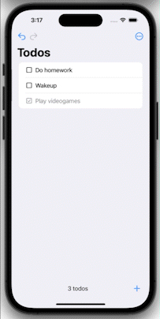

# CoreTodos


## About
`CoreTodos` is a simple native iOS app for tracking a list of todos. This app demonstrates `CoreData`, including persistence, undo, and redo functionality.

## Table of Contents
- [CoreTodos](#coretodos)
  - [About](#about)
  - [Features](#features)
  - [Architecture](#architecture)
  - [Modeling State](#modeling-state)
  - [Performing CRUD Operations](#performing-crud-operations)
    - [Saving](#saving)
    - [Adding](#adding)
    - [Remove](#remove)
    - [Update](#update)
    - [Update All](#update-all)
    - [Undo and Redo](#undo-and-redo)
    - [Interacting With Our ViewModel](#interacting-with-our-viewmodel)
  - [More](#more)
  - [Thanks!](#thanks)

<hr> 

## Features
**Add, Edit, Remove Todos**

Todos can be added, edited, removed, undoed, and redoed. Changes are persisted.
<div>


</div>

**Selection**

Todos can be multi-selected for toggling their completion status or deleted. These changes can be persited when the user confirms them, as well as undoable and redoable
<div>



</div>

## Architecture
**MVVM && PointFree Dependencies**

This app is built using MVVM and CoreData alongside several of [PointFree's]() dependencies, including [SwiftUI-Navigation](https://github.com/pointfreeco/swiftui-navigation), [Identified-Collections](https://github.com/pointfreeco/swift-identified-collections), and [Tagged](https://github.com/pointfreeco/swift-tagged). [Check out my other repo for an indepth look into their SwiftUI-Navigation combined with MVVM.]()

## Modeling State
The highlight of this app is simply CoreData. Using this library, we can persist our data *locally*, that is, on our device. We are simply managing a list of todos with `CRUD` operations, undo, and redo. A todo has a unique ID, a description, and a flag determining if the todo is complete or not. Our Swift type would appear as such:
```swift
struct Todo: Identifiable { 
    let id: UUID
    var description: String
    var isComplete: Bool
}
```
We could also model a separate type strictly for CoreData, a `CoreTodo`, that would only be used when interacting with CoreData directly:
**IMG GOES HERE**

However, when interacting with CoreData directly, it would be nice to delegate all of that logic handling, into its own type, instead of littering our view code and even perhaps our view model with scattered logic. Instead, we can build a single type, called the `CoreDataManager`, and allow our view model to interact with it. Our app is simply a list of todos, supporting `CRUD` operations, as well as undo and redo. Our new type could look as such:
```swift
struct CoreDataManager {
  static let shared = CoreDataManager()
  let container: NSPersistentContainer
  var canUndo: Bool { container.viewContext.undoManager?.canUndo ?? false }
  var canRedo: Bool { container.viewContext.undoManager?.canRedo ?? false }

  init() {
    // ...
  }

  func fetch() -> [Todo]? {
      // ...
  }
  
  func add(_ newTodo: Todo) {
    // ...
  }
  
  func remove(_ todo: Todo) {
    // ...
  }
  
  func update(_ todo: Todo) {
    // ...
  }
  
  func update(_ todos: [Todo]) {
    // ...
  }
  
  func undo() {
    // ...
  }
  
  func redo() {
    // ...
  }
  
  private func save() {
    // ...
  }
}
```

## Performing CRUD Operations
Before we write code for our CRUD operations, we need to decide how we manage our CoreData -- either directly within the Persistent Container's Managed Object Context, or we could store another data structure, such as an array of our CoreTodos. For the simplicity of this app, I stuck to interacting with the object context directly, so there is no need to add a property nor the logic to update that property to the CoreDataManager.

### Saving
It is very important to make sure to save any uncommited changes to the managed object context. If we perform CRUD operations to it, but do not save, our data will not be persisted. We can this by implementing our `save()` function:
```swift
  private func save() {
    if !container.viewContext.hasChanges  { return }
    do {
      try container.viewContext.save()
    } catch {
      print("CORE DATA FAILED TO SAVE: \(error)")
    }
```

### Adding
Next, we'd like to perist our Todos. We can implement our `add` function as such:
```swift
  func add(_ newTodo: Todo) {
    container.viewContext.undoManager!.beginUndoGrouping()
    let coreTodo = CoreTodo(context: container.viewContext)
    coreTodo.id = newTodo.id.rawValue
    coreTodo.body = newTodo.description
    coreTodo.isComplete = newTodo.isComplete
    save()
    container.viewContext.undoManager!.endUndoGrouping()
  }
```
Notice we start and end the function with some bizzare `undoManager!.beginUndoGrouping()` and `undoManager!.endUndoGrouping()`. The `UndoManager`, well, manages undo logic. However, we have to tell it when and or how to track undoing operations. Then, when we call it to undo or redo, it does all the heavy lifting. Calling `.beginUndoGrouping()` and `endUndoGrouping` is a simple means of tracking these changes, but we could use a callback:
```swift
  func add(_ newTodo: Todo) {
    container.viewContext.undoManager!.registerUndo(withTarget: self) { targetSelf in
      targetSelf.remove(newTodo)
    }
    let coreTodo = CoreTodo(context: container.viewContext)
    coreTodo.id = newTodo.id.rawValue
    coreTodo.body = newTodo.description
    coreTodo.isComplete = newTodo.isComplete
    save()
  }
```
However, this would require our `CoreDataManager` to become a reference type (a class) as documented in Apple's documentation: `The target needs to be a reference type so that its state can be undone or redone by the undo manager. `. This is less than desirable in this application, so sticking to the previous implementation is better. And yes, in production, force unwrapping would unsafe and would require better means of handling. We can add this boilerplate to each of our other CRUD operations.

But may still be wondering, what is grouping? Grouping is simply the collection of uncommited operations that mutate the Core Data. For example, we performed four mutations before we called save:
```swift
  func add(_ newTodo: Todo) {
    container.viewContext.undoManager!.beginUndoGrouping() // Start recording
    let coreTodo = CoreTodo(context: container.viewContext) // Mutate
    coreTodo.id = newTodo.id.rawValue // Mutate
    coreTodo.body = newTodo.description // Mutate
    coreTodo.isComplete = newTodo.isComplete // Mutate
    save() // Commit
    container.viewContext.undoManager!.endUndoGrouping() // End recording
  }
```
Now this will probably get your mind racing because of all the possible permuations of mutations and bad things that could occur if one played with grouping. For the purposes of this app, I will not go into an indepth discussion or analysis on this.

### Remove
We implement `remove` as follows:
```swift
  func remove(_ todo: Todo) {
    container.viewContext.undoManager!.beginUndoGrouping()
    let cds = Array(container.viewContext.registeredObjects) as! [CoreTodo]
    if let coreTodo = cds.first(where: { $0.id == todo.id.rawValue }) {
      container.viewContext.delete(coreTodo)
      save()
    }
    else {
      print("CORE DATA FAILED TO REMOVE: \(todo)")
    }
    container.viewContext.undoManager!.endUndoGrouping()
  }
```
As mentioned before, I chose not to manage my own collection of CoreTodos, but instead to simply reference the managed object context directly. To get its objects, we access the `registeredObjects` property and force cast it as a `CoreTodo` We then search that array for the first object we come across,  then delete it from the context and save our changes.

### Update
We can implement `update`  very similar to delete, except we update the first object we found:
```swift
  func update(_ todo: Todo) {
    container.viewContext.undoManager!.beginUndoGrouping()
    let cds = Array(container.viewContext.registeredObjects) as! [CoreTodo]
    if let cd = cds.first(where: { $0.id == todo.id.rawValue }) {
      cd.isComplete = todo.isComplete
      cd.body = todo.description
      save()
    }
    container.viewContext.undoManager!.endUndoGrouping()
  }
```

### Update All
In some occassions, we want to update, or really, replace all the todos. We can do so as such:
```swift
func update(_ todos: [Todo]) {
    container.viewContext.undoManager!.beginUndoGrouping()
    let cds = Array(container.viewContext.registeredObjects) as! [CoreTodo]
    cds.forEach(container.viewContext.delete)
    todos.forEach { todo in
      let coreTodo = CoreTodo(context: container.viewContext)
      coreTodo.id = todo.id.rawValue
      coreTodo.body = todo.description
      coreTodo.isComplete = todo.isComplete
    }
    save()
    container.viewContext.undoManager!.endUndoGrouping()
  }
```
Here we delete all of our data from memory, create them again, then save.


### Undo and Redo
Both of these are very simple lines, thanks to CoreData. It's doing all the heavy work, all we had to do was track when to track undoing:
```swift
  func undo() {
    container.viewContext.undoManager!.undo()
    save()
  }
  
  func redo() {
    container.viewContext.undoManager!.redo()
    save()
  }
```

### Interacting With Our ViewModel
Now, we could build our view and view model just as we'd build any other simple app, without having to really worry about CoreData controlling how we do things. Whenever we perform logic on our `Todo`s, we can reach out to our `CoreDataManager.shared` instance, and call a method for a CRUD operation. 


## More
Some future features that would be neat:
1. Preserve ordering in CoreData. CoreData is stored and retrieved in a nondeterministic way, app currently does not support proper ordering
2. On check, sort todos. Todos that are completed should float to the bottom, and continuously clicking todos checkboxes or editing their descriptions should debounce the effect

## Thanks!
Thanks for checking out the repo! Try running the app to see all the features and more for yourself!


